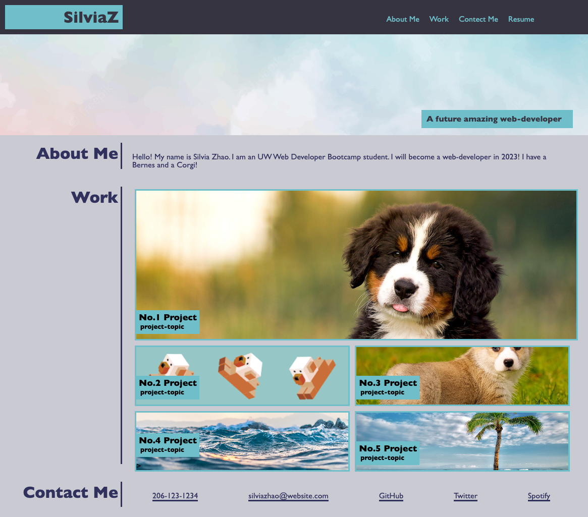

# Portfolio-02Challenge

# Project Description
Create a web application from scratch. Build a portfolio page, which I can add to as the course progresses. Using new skills includes flexbox, media queries, and CSS variables for this poroject. 

# Deployed Application Link

https://liyuansilviazhao.github.io/Portfolio-02Challenge/

# Screenshot 

